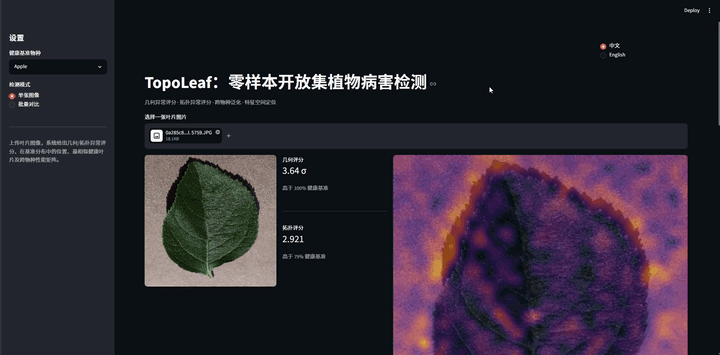
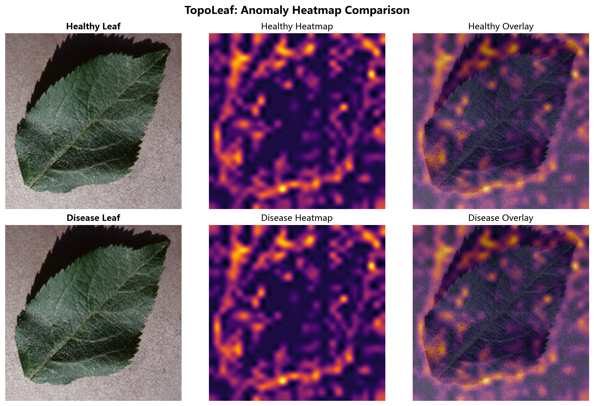
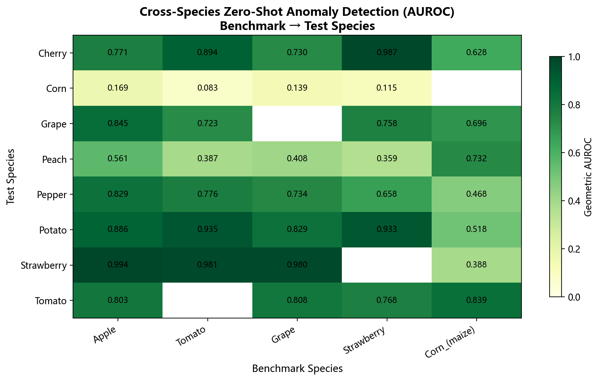
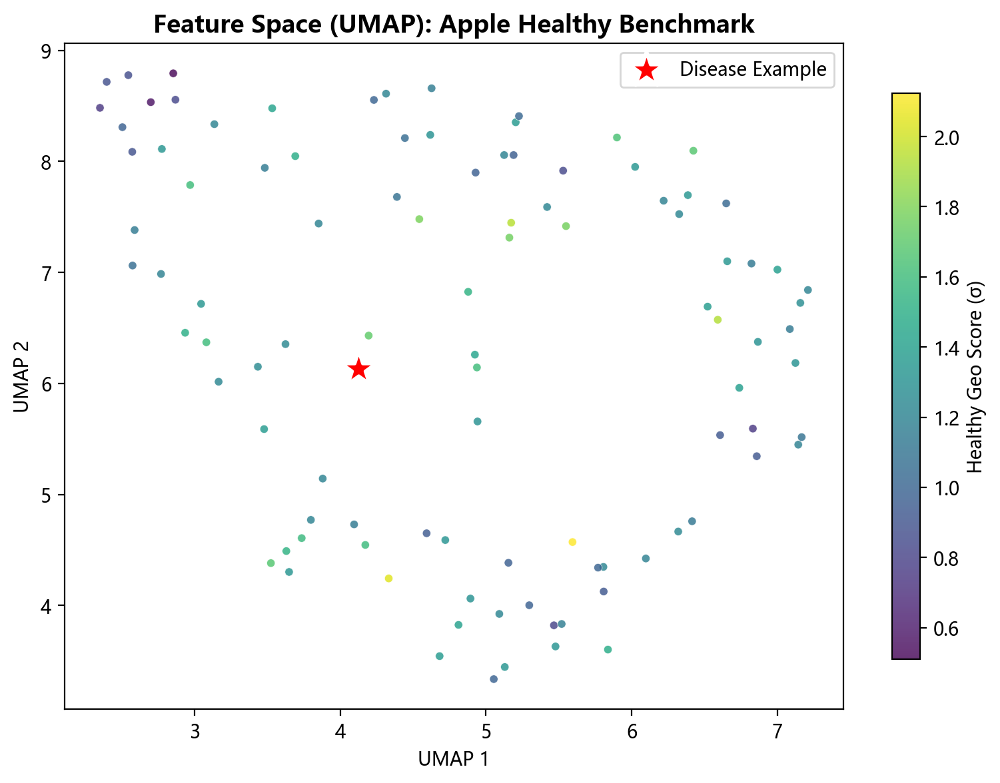
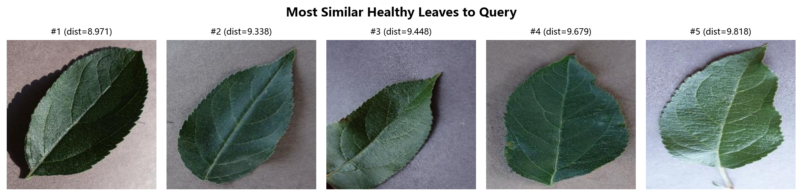

# TopoLeaf 🍃 – Zero-Shot Open-Set Plant Disease Detection

**零样本 · 开放集 · 跨物种植物病害异常检测**

[](https://topoleaf.streamlit.app/)
[](https://doi.org/xxxxx/xxxxx)
[](LICENSE)
[](mailto:praxel.cn@gmail.com)

> **无需训练 · 无需病害标注 · 仅需几张健康叶片**  
> 基于视觉基础模型（DINOv2）与代数拓扑（持续同调），检测任意未知植物病害。

---


---
## 📌 核心亮点

- 🚫 **零样本检测**：不用任何病害标注数据，只用健康叶片建立基准。
- 🌍 **跨物种泛化**：用苹果叶建基准，可直接检测草莓、番茄、葡萄、马铃薯等作物的病害。
- 🧠 **几何 + 拓扑双评分**：局部特征距离 + 局部持续同调，互补验证，提供连续异常评分而非简单二分类。
- 📱 **边缘部署友好**：模型冻结，推理仅需 CPU，可部署在无人机、手持诊断仪上。
- 🔬 **可解释热力图**：无需像素级标注，自动定位病斑区域。
- 📊 **系统验证**：5 基准 × 8 物种 跨物种交叉验证矩阵，6 种基线方法对比，多骨干网络验证。

---

## 🖼️ 效果展示

### 热力图对比（健康 vs 病害）
  
*热力图暖色区域表示病斑位置，健康叶片无明显高亮。*

### 跨物种泛化矩阵
  
*5 个基准物种 × 8 个测试物种的几何评分 AUROC 矩阵。*

### 特征空间定位（UMAP）
  
*健康基准在特征空间的分布，红星标记病害示例的位置。*

### 最相似健康邻居
  
*上传图像与健康基准库中最相似的 5 张叶片对比。*

---

## 🎥 在线体验

**云端轻量版**（仅 Apple 基准 + 几何评分 + 热力图）：  
👉 [](https://topoleaf.streamlit.app/)

**本地完整版**（几何+拓扑双评分、UMAP 定位、邻居搜索、跨物种矩阵等）： 
```bash
streamlit run app.py
```

上传任意叶片图像，系统会实时返回：
- 几何异常评分（P90 σ）与健康基准分布
- 拓扑异常评分
- 病斑热力图叠加
- 最相似健康叶片展示
- 特征空间 UMAP 定位
- 跨物种 AUROC 性能矩阵

---

## 🔧 安装

```bash
git clone https://github.com/Shutong-Hou/TopoLeaf.git
cd TopoLeaf
pip install -r requirements.txt
```
- `app.py` → 云端轻量版，无需本地缓存  
- `app_local.py` → 本地完整版，需先运行 `precompute_final.py` 生成缓存

### 数据集准备

1. 下载 [PlantVillage 数据集](https://github.com/spMohanty/PlantVillage-Dataset)
2. 将 `raw/color` 目录放入 `data/PlantVillage/` 下，结构如下：
   ```
   data/PlantVillage/raw/color/
       Apple___healthy/
       Apple___scab/
       Corn___healthy/
       ...
   ```

### 生成预计算缓存

```bash
python precompute_final.py
```
脚本会提取基准特征、计算评分分布、降维投影，缓存至 `benchmark_cache/`。Demo 启动时秒加载。

### 启动 Demo

```bash
streamlit run app.py
```

---

## 📊 实验结果

### 以 Apple 为基准的跨物种零样本检测 AUROC

| 测试物种 | 几何评分 | 拓扑评分 | 融合评分 |
|---------|---------|---------|---------|
| Strawberry | 0.994 | 0.791 | 0.933 |
| Potato | 0.886 | 0.682 | 0.792 |
| Grape | 0.845 | 0.610 | 0.753 |
| Pepper | 0.829 | 0.676 | 0.779 |
| Tomato | 0.803 | 0.662 | 0.742 |
| Peach | 0.561 | 0.446 | 0.503 |
| Corn | 0.169 | 0.209 | 0.135 |

完整 5×8 交叉验证矩阵（5 个基准物种 × 8 个测试物种）见 [`results/`](./results/) 目录。

更多实验（基线对比、消融实验、多骨干网络验证、自适应融合、失败案例分析）见项目中的各阶段脚本。

---

## 📁 项目结构

```
TopoLeaf/
├── app.py                      # Streamlit Demo
├── app_local.py                # 本地完整版，需先运行 `precompute_final.py` 生成缓存
├── precompute_final.py         # 预计算缓存生成
├── generate_assets.py          # 生成演示素材
├── requirements.txt            # Python 依赖
├── README.md                   # 项目说明
├── phase1~11_*.py              # 完整实验脚本（1~11 阶段）
├── baseline_comparison.py      # 基线方法对比
├── ablation_study.py           # 超参数消融
├── multibackbone_validation.py # 多骨干网络验证
├── adaptive_fusion.py          # 自适应融合策略
├── visualize_umap.py           # UMAP 可视化
├── boundary_cases.py           # 边界案例分析
├── assets/                     # 演示图片、GIF
├── data/                       # 数据集目录（用户自行放置）
├── results/                    # 实验结果 JSON
├── benchmark_cache/            # 预计算缓存（脚本生成）
└── features_cache/             # 特征缓存（脚本生成）
```

---

## 📝 引用

若您使用了本项目，请通过 Zenodo 引用：

```bibtex
@dataset{hou2025topoleaf,
  author       = {Shutong Hou},
  title        = {TopoLeaf: Zero-Shot Open-Set Plant Disease Detection},
  year         = 2025,
  publisher    = {Zenodo},
  doi          = {10.5281/zenodo.xxxxxxx},
  url          = {https://doi.org/10.5281/zenodo.xxxxxxx}
}
```


---

## 📬 联系

📧 Email: [praxel.cn@gmail.com](mailto:praxel.cn@gmail.com)  
💬 欢迎开 Issue 讨论或提交 PR。

---

## 📜 许可证

本项目基于 [MIT License](LICENSE) 开源。

---

## 🙏 致谢

- [PlantVillage](https://github.com/spMohanty/PlantVillage-Dataset) 数据集
- [DINOv2](https://github.com/facebookresearch/dinov2) 视觉基础模型
- [Ripser](https://github.com/scikit-tda/ripser.py) 持续同调计算
- [Streamlit](https://streamlit.io/) 交互式 Demo 框架
- [UMAP](https://umap-learn.readthedocs.io/) 降维可视化

---

*Made with ❤️ by Shutong Hou*
